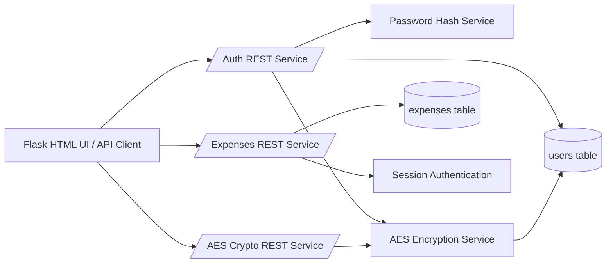
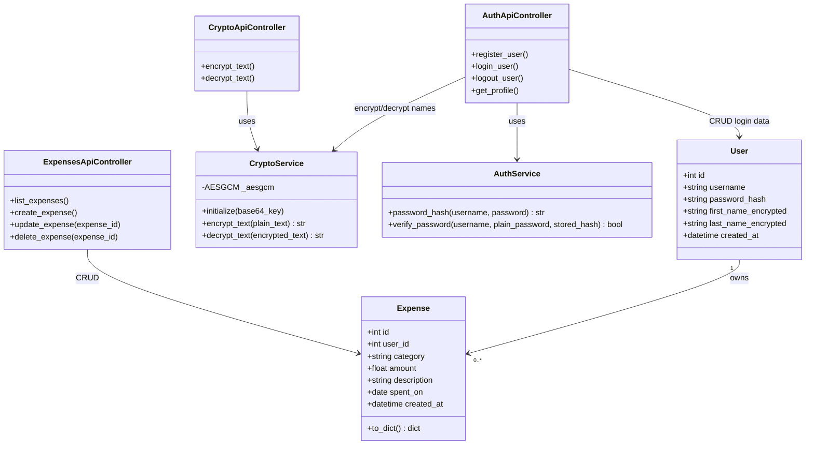

# Family Expenses - Service and Class Design

## Service diagram

## Class diagram

## Requirement mapping

- RESTful services for family expenses:
  - `GET/POST /api/expenses`
  - `PUT/DELETE /api/expenses/<id>`
- Each member has account with username + password:
  - `POST /api/auth/register`
  - `POST /api/auth/login`
- Categories are restricted to:
  - `intretinere`, `mancare`, `distractie`, `scoala`, `personale`
- AES service:
  - `POST /api/crypto/encrypt`
  - `POST /api/crypto/decrypt`
- Personal data encryption before DB save:
  - `first_name` and `last_name` are AES encrypted before insert in `users` table.
- Password hashing rule:
  - `sha256(username + ":" + password)`
- Flask interface:
  - `/` serves HTML that calls all REST services with JavaScript `fetch`.
