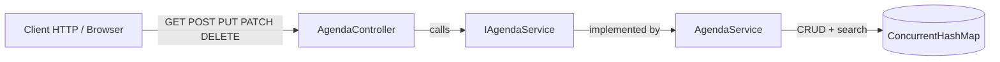
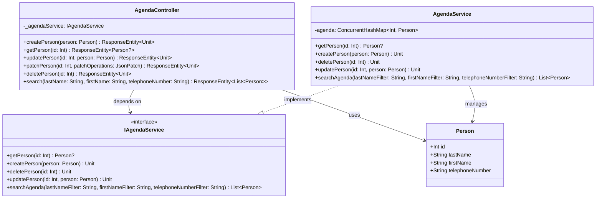

# Laborator 4 - Analiza aplicatiei PhoneAgenda

## 1. Diagrama de servicii

Observatii:
- `AgendaController` expune endpoint-urile REST.
- `IAgendaService` este contractul de business.
- `AgendaService` implementeaza logica de agenda.
- Persistenta este in-memory (`ConcurrentHashMap`).

## 2. Diagrama de clase (UML)

## 3. Analiza SOLID

### S - Single Responsibility Principle
- `Person` respecta SRP (model simplu de date).
- `AgendaController` respecta SRP in sens MVC (gestionare request/response).
- `AgendaService` este in mare SRP, dar include si date seed (`initialAgenda`) si gestionare persistenta in-memory.

### O - Open/Closed Principle
- Prezenta `IAgendaService` ajuta extinderea (alta implementare) fara modificari majore in controller.
- Totusi, cautarea este hard-codata in `AgendaService`; pentru noi strategii de filtrare ar necesita modificari in clasa.

### L - Liskov Substitution Principle
- `AgendaService` poate substitui `IAgendaService` fara a rupe contractul observat in controller.
- Nu exista ierarhii complexe care sa ridice probleme LSP.

### I - Interface Segregation Principle
- `IAgendaService` este compacta, dar combina CRUD + search.
- Pentru modularitate mai buna, ar putea fi separata in `IAgendaCrudService` si `IAgendaSearchService`.

### D - Dependency Inversion Principle
- `AgendaController` depinde de abstractie (`IAgendaService`), nu de implementare concreta.
- Injectarea se face prin camp `@Autowired`; pentru testabilitate mai buna se recomanda constructor injection.

## 4. Concluzie
- Aplicatia urmeaza destul de bine principiile de baza pentru un exemplu didactic REST.
- Puncte principale de imbunatatire: separarea responsabilitatilor de persistenta/cautare si folosirea constructor injection.
